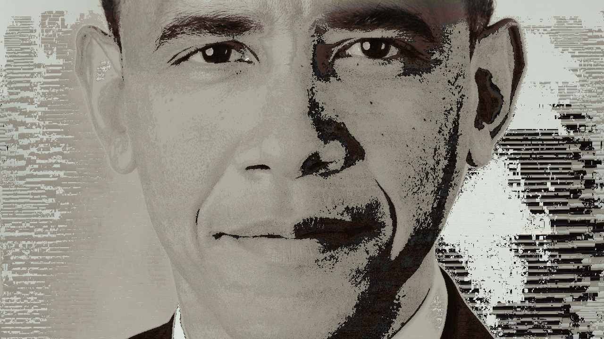

# IMAGIFIER

Built in python, it can tury any input image into any target image just by scrambling the pixels of the input image and rearranging and placing them in the new position.

## Example:

### Input Image:


### Target Image:


### Output Image [Using best fit algorithm]:



> **Note:** The Output image is smaller because before conversion the algorithm truncates and compresses the image for faster processing.

## How it works:

It uses two main algorithms:

1. **First fit algorithm** (faster)
2. **Best fit algorithm** (slower) (Very slow don't use it.)

Both the algorithm works based on the same concept. Let me give an idea. Imagine that the input image is the same image as the target image, but the only difference is that the pixels are rearranged randomly. So to generate the orginal image, you traverse each pixel of the target image and for each pixel you compare it with the pixels of the input image, the pixel (which resembles very close to the target image's current pixel) is placed on the corresponding position in the new output image. This is how the algorithm works. Now if the input image is any other image, it tries to find the best matching or the closest matching pixel, for every pixel of the target image and that pixel is placed in the correct position as that of the target image's pixel (to which it matches very close).

> **Note: Berore getting started, both the images size are made same (eg. 240x480 and 320X125 -> 220x125 and 220x125) and then compressed to a lower resolution**

### First fit algorithm

This algorithm is faster among all the algorithms (right now only two). It traverses all the pixels (of target image) and for each pixel it traverses some pre-determined (user defined value) amount of pixels of the input image, it compares that target image pixel with the input image pixel, and determines the closeness of the two pixel. Closeness is determined as follow:

1. Pixels are considered as points (or vectors) in 3D space (each dimension -> R, G, B).
2. The distance between target image pixel and input image pixel is calculated by subtracting two vectors and calculating the distance of the difference vector.
3. The length is normalized to a value ranging from 0 to 1 (by dividing it with the length of the maximum difference vector i.e the difference vector between the origin vector and the 255i + 255j+ 255k vector).
4. It is subtracted from 1, and hence it now represents the closeness of the two points.

Now the pixel's posistion with the highest closeness is tracked, and the pixel is placed at the target pixel's position in the new output image, and that pixel is marked as taken (the taken list takes care of it. Its size is the no. of total pixels after compression) and so cannot be used in further comparisons.

But the drawback here is that, a pixel of the input image which is swapped and hence can no longer be swapped with the upcoming pixels, may resemble very close to an another upcoming pixel than it currently does with the current pixel. This problem is taken care by the best fit algorithm.

### Best fit algorithm

It does the same job as the above algorithm but with a difference. In the first fit algorithm an input image's pixel won't be compared with that of the current pixel of the target image, if it is already taken. But this algorithm doesn't consider it. If the most closly resembling pixel is already taken by some other pixel in some other position, it checks to which pixel it closely resembles to either the old pixel (of target image) or the current pixel of the target image.

```
nr, nc = get_rc(taken_by[index[0] * w + index[1]], w)

if taken[index[0] * w + index[1]] == 1 and closest > cmp_pxls(input_img[index[0]][index[1]], target_img[nr][nc]):
```

Here the taken_by array keeps track of the position of the old target image pixel (to which it closely resembled, before the current pixel) so that we can call the check function again for that old pixel in that position to find another pixel which it closely resembles to, other than this pixel.

```
old_i = taken_by[index[0] * w + index[1]]
taken_by[index[0] * w + index[1]] = i
check(old_i)
```

Here i is the current position.

I am aware that the overuse of `this` and `that` in my statments might be confusing, but I tried my best!

## Run

python app.py <path_to_input_img> <path_to_target_path>
